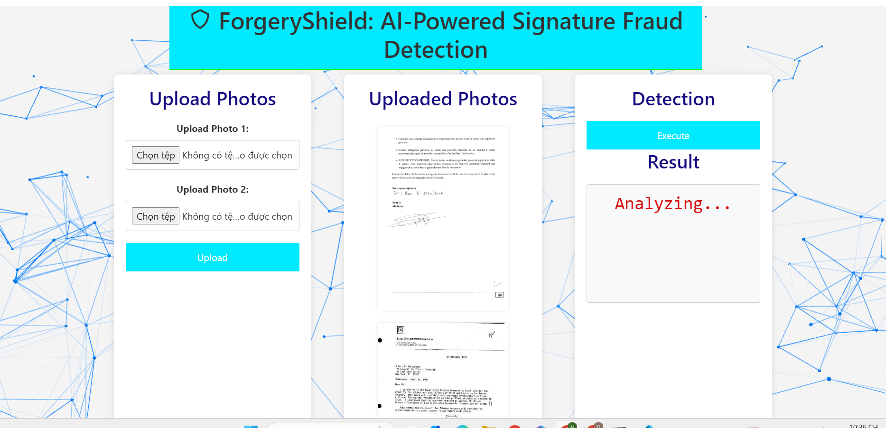

## Overview

This system uses artificial intelligence to detect signature forgeries. It is divided into three main components:

1. **Signature Extraction using YOLO**
2. **Signature Cleaning using CycleGAN**
3. **Feature Extraction and Forgery Detection using ResNet-18**




## System Components

### 1. Signature Extraction using YOLO

This component uses the YOLO (You Only Look Once) model to detect and extract signatures from documents or images. YOLO is one of the most efficient object detection models, capable of real-time object detection and classification.

### 2. Signature Cleaning using CycleGAN

After extracting the signature, this part uses the CycleGAN model to clean and enhance the quality of the signature. CycleGAN is a method for image-to-image translation without paired examples, improving image quality by translating between different image domains.

**Citation**: The code and methods for CycleGAN are adapted from the [CycleGAN repository](https://github.com/junyanz/CycleGAN). Special thanks to the authors and contributors of this project.

### 3. Feature Extraction and Forgery Detection using ResNet-18

Finally, the system uses the ResNet-18 model to extract features from the cleaned signature and identify characteristics that may indicate forgery. ResNet-18 is a deep neural network architecture known for its effective feature learning capabilities.

## Installation

To run this system, you need to install the following dependencies:

- PyTorch
- OpenCV
- Other dependencies listed in `requirements.txt`
- Miniconda
## Contact
If you have any questions or would like to contribute to the project, please contact us at: nguyentrongduc_t66@hus.edu.vn

## Running the Web Application

To run the web application, follow these steps:

1. **Navigate to the `web` Directory**

   Change your current directory to the `web` folder where `app.py` is located:

   ```bash
   conda create -n dl python=3.10.12
   conda activate dl
   pip install -r requirements.txt
   python app.py
